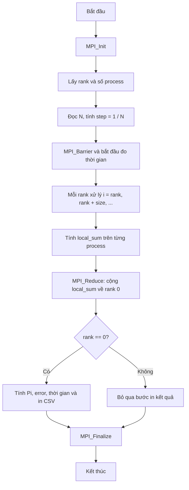

# Flowchart MPI

Sơ đồ này mô tả luồng xử lý của phiên bản `src/pi_mpi.c`.

## Điểm cần trình bày

- Mỗi process xử lý một tập chỉ số độc lập theo kiểu round-robin.
- Không có ghi đồng thời vào cùng một biến giữa các process.
- `MPI_Reduce` thực hiện phép cộng các tổng cục bộ và trả kết quả về `rank 0`.
- Chỉ `rank 0` in kết quả để output không bị lặp.
