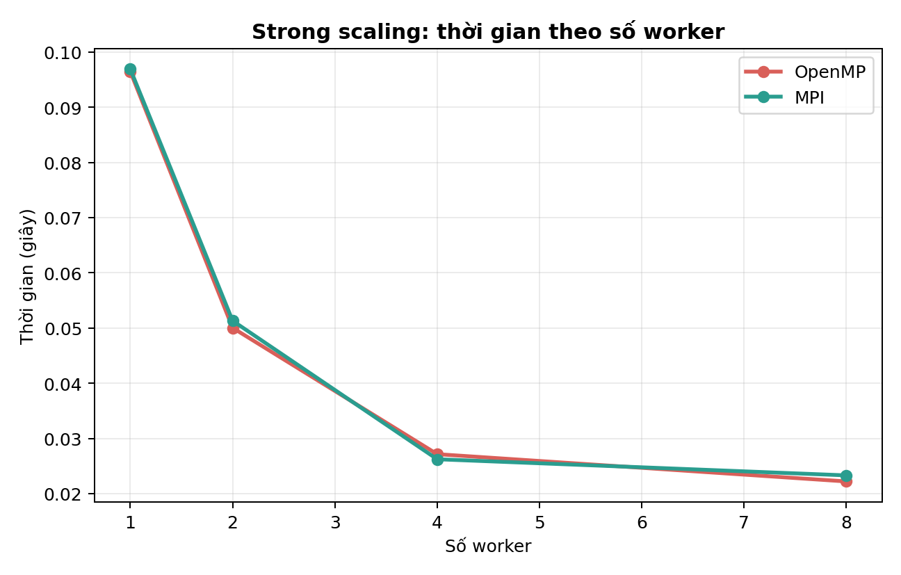
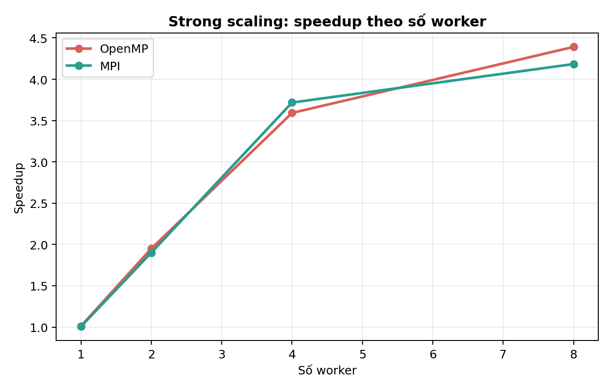
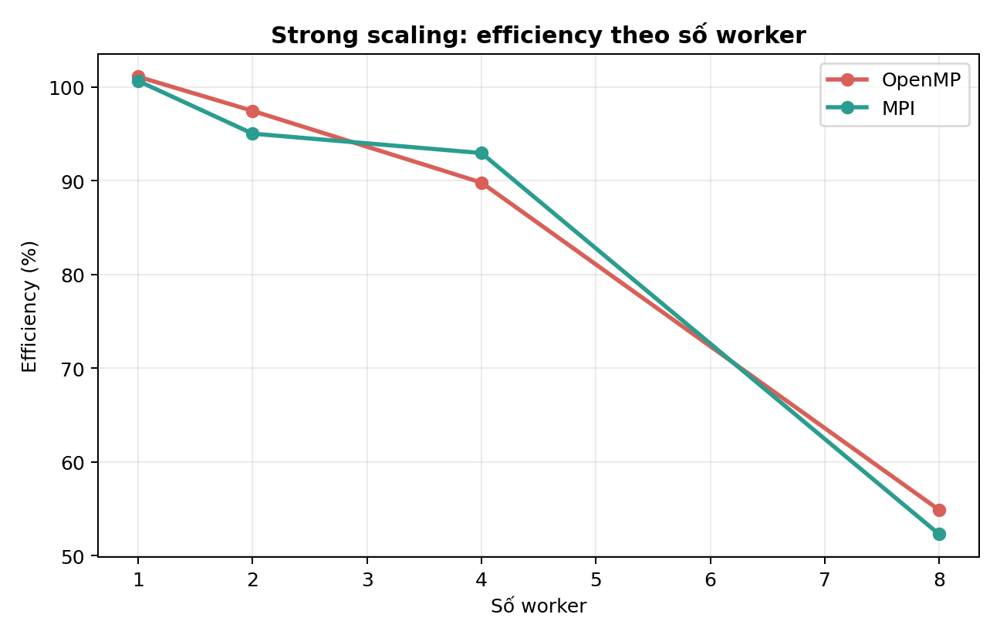
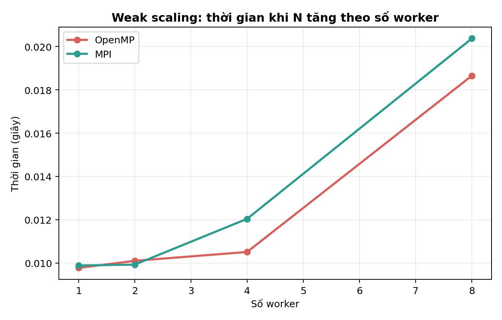
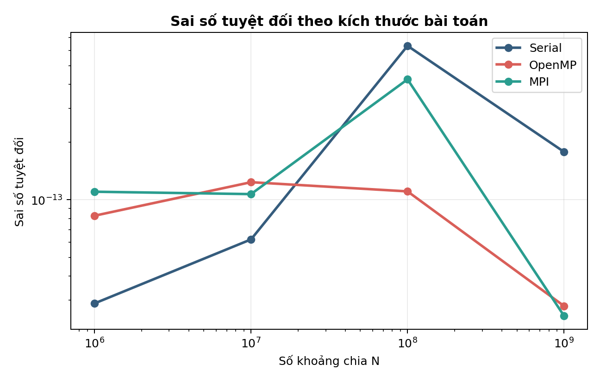

# Nội dung báo cáo do Người 2 phụ trách

Tài liệu này là bản nội dung sẵn để ghép vào báo cáo chung sau khi nhóm thống nhất template, đánh số hình và đánh số bảng.

## Chương 4. Cài đặt phiên bản MPI

Phiên bản MPI được cài đặt trong `src/pi_mpi.c`. Sau khi khởi tạo môi trường bằng `MPI_Init`, mỗi process lấy `rank` và tổng số process. Miền chỉ số được chia theo kiểu round-robin:

```text
process rank r xử lý i = r, r + size, r + 2 × size, ...
```

Mỗi process tính `local_sum` độc lập. Sau đó, chương trình gọi `MPI_Reduce` với phép toán `MPI_SUM` để gộp các tổng cục bộ về `rank 0`. Chỉ `rank 0` tính giá trị Pi cuối cùng và in kết quả CSV. Cách tổ chức này minh họa decomposition, local computation, message passing và reduction.

Flowchart: [Flowchart_MPI.md](Flowchart_MPI.md).

## Chương 5. Kịch bản thực nghiệm

### 5.1. Cấu hình và nguyên tắc đo

Cấu hình chi tiết được ghi tại [Cau_hinh_thuc_nghiem.md](Cau_hinh_thuc_nghiem.md). Mỗi cấu hình chạy ba lần và lấy trung bình. Các phiên bản dùng cùng cờ tối ưu `-O3`; thời gian in kết quả không nằm trong vùng đo chính.

### 5.2. Ảnh hưởng của kích thước bài toán

Chạy ba phiên bản với:

```text
N = 10^6, 10^7, 10^8, 10^9
```

OpenMP và MPI dùng cố định `4` worker. Mục tiêu là kiểm tra thời gian, sai số và khả năng xử lý `N` lớn.

### 5.3. Strong scaling

Giữ cố định:

```text
N = 10^8
```

Thay đổi số worker:

```text
p = 1, 2, 4, 8
```

### 5.4. Weak scaling

Giữ khối lượng công việc trên mỗi worker gần như cố định:

```text
p = 1  -> N = 10^7
p = 2  -> N = 2 × 10^7
p = 4  -> N = 4 × 10^7
p = 8  -> N = 8 × 10^7
```

## Chương 6. Kết quả và đánh giá

### 6.1. Strong scaling

Bảng nguồn: [`results/table_strong_scaling.csv`](../results/table_strong_scaling.csv).

| Worker | OpenMP time (s) | MPI time (s) | OpenMP speedup | MPI speedup | OpenMP efficiency | MPI efficiency |
|---:|---:|---:|---:|---:|---:|---:|
| 1 | 0.096447 | 0.096887 | 1.010946 | 1.006354 | 101.09% | 100.64% |
| 2 | 0.050027 | 0.051308 | 1.949007 | 1.900322 | 97.45% | 95.02% |
| 4 | 0.027144 | 0.026225 | 3.592084 | 3.717868 | 89.80% | 92.95% |
| 8 | 0.022202 | 0.023302 | 4.391535 | 4.184231 | 54.89% | 52.30% |

Với `N = 10^8`, cả OpenMP và MPI cải thiện rõ đến `4` worker. Khi tăng lên `8` worker, speedup vẫn tăng nhưng efficiency giảm xuống khoảng `52-55%`. Máy thử nghiệm có Apple M1 gồm `4` performance core và `4` efficiency core, vì vậy kết quả này phù hợp với giới hạn phần cứng và overhead song song hóa.

Efficiency nhỉnh hơn `100%` ở `1` worker là sai khác đo thời gian nhỏ giữa các lượt chạy riêng biệt, không phải superlinear speedup có ý nghĩa.







### 6.2. Weak scaling

Bảng nguồn: [`results/table_weak_scaling.csv`](../results/table_weak_scaling.csv).

OpenMP duy trì weak efficiency khoảng `92.98%` tại `4` worker và giảm còn `52.40%` tại `8` worker. MPI duy trì khoảng `82.11%` tại `4` process và giảm còn `48.53%` tại `8` process. Xu hướng giảm ở mức `8` worker phản ánh overhead và đặc điểm CPU không đồng nhất giữa performance core và efficiency core.



### 6.3. Sai số theo N

Bảng nguồn: [`results/table_error_by_n.csv`](../results/table_error_by_n.csv).

Các phiên bản đều cho kết quả gần Pi chuẩn, với sai số tuyệt đối cỡ `10^-14` đến `10^-13`. Khi `N` tăng, sai số không giảm đơn điệu tuyệt đối vì phép cộng số thực dấu phẩy động tích lũy rounding error khác nhau giữa Serial, OpenMP và MPI. Tuy nhiên, chương trình chạy ổn định đến `N = 10^9`, không bị tràn biến đếm và đáp ứng yêu cầu độ chính xác của đề tài.



### 6.4. So sánh OpenMP và MPI

Trên một máy cá nhân, OpenMP và MPI có thời gian tương đối gần nhau vì cùng thực hiện lượng phép tính tương tự. OpenMP dùng shared memory và reduction nội bộ giữa thread; MPI dùng process riêng và `MPI_Reduce`. MPI trong thí nghiệm này chủ yếu minh họa mô hình message passing trên một máy, chưa phải đánh giá distributed memory trên cluster nhiều node.

### 6.5. Hạn chế

- Benchmark chạy trên một máy cá nhân, chưa phản ánh chi phí truyền thông giữa nhiều node.
- Kết quả có thể dao động theo ứng dụng nền và trạng thái hệ điều hành.
- `N` nhỏ làm overhead chi phối, vì vậy không nên dùng để kết luận về scalability.
- Hybrid MPI + OpenMP chưa triển khai vì nằm ngoài phạm vi bắt buộc.
